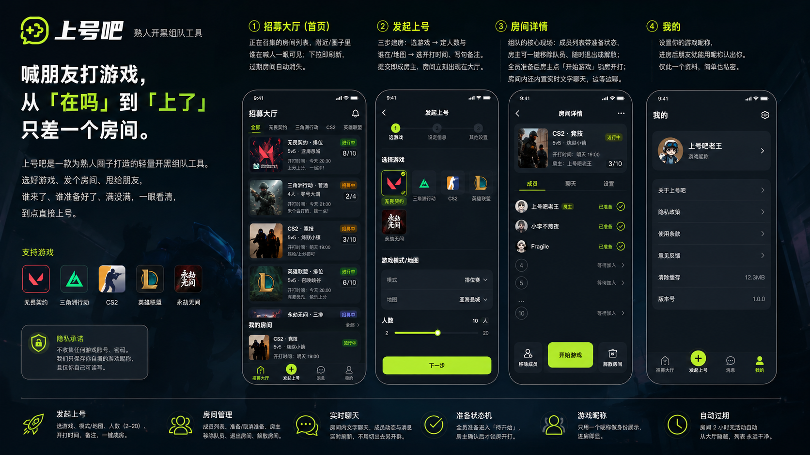
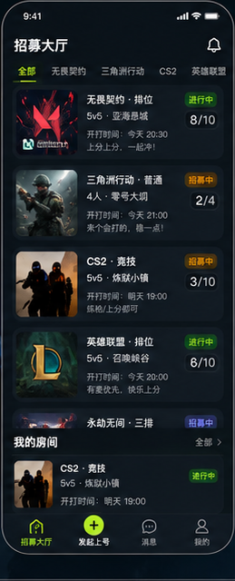
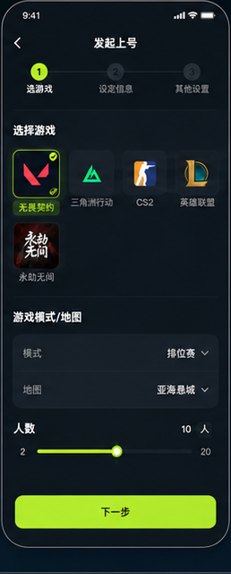
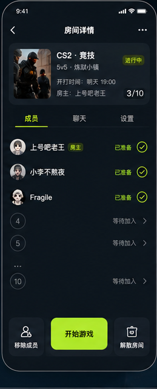
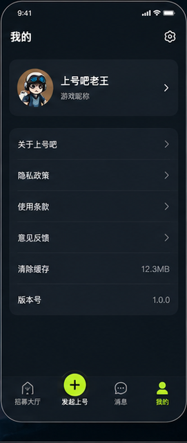
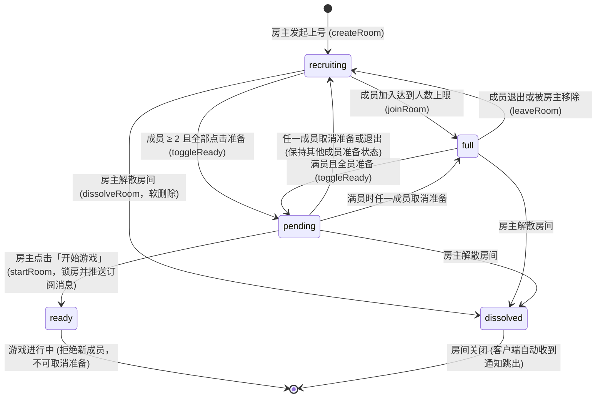

<p align="center">
  
</p>

<div align="center">

# 上号吧 · Let's Game! 🎮
### 专为熟人圈子打造的轻量电竞开黑组队微信小程序

**「喊朋友打游戏，从『在吗』到『上了』，只差一个房间。」**

<p align="center">
  
  
  
  
  
  
</p>

<p align="center">
  <a href="#-项目简介">项目简介</a> •
  <a href="#-页面效果展示">页面展示</a> •
  <a href="#-核心特性">核心特性</a> •
  <a href="#️-业务状态机与核心流程">状态机设计</a> •
  <a href="#-技术架构与接口设计">技术架构</a> •
  <a href="#-快速开始与部署指南">部署指南</a> •
  <a href="#-自动化测试">自动化测试</a> •
  <a href="#-隐私与安全承诺">隐私承诺</a>
</p>

</div>

---

## 📖 项目简介

一群朋友想一起开黑打游戏时，最常见却最令人头疼的痛点是：**群聊碎片化严重、沟通成本极高**。微信群里反复 @人、刷屏接龙、问“谁来、几排、还差几个、几点开打”，往往等凑齐人时兴致已经过去了一半。

**「上号吧」** 是一款面向**熟人开黑圈子**的微信小程序。用户只需 10 秒发起一个上号房间，选定游戏、模式、人数与开打时间，把卡片甩进群里，朋友点击一键入房。谁来了、谁准备好了、满没满全透明展示；全员准备后房主一键开打，自动下发微信服务通知直达手机，完成一次爽快高效的开黑闭环！

### 痛点对比

| 传统微信群开黑 ❌ | 使用「上号吧」组队 ✅ |
| :--- | :--- |
| **沟通碎片化**：群内反复 @人、接龙、问“在吗打不打”，信息被其他群聊冲走 | **结构化成房**：房间卡片包含游戏、模式、人数、开打时间，一目了然 |
| **状态不可见**：谁去上厕所了、谁准备好了、到底几个人在，反复口头询问 | **实时就绪板**：毫秒级实时同步每位队员准备状态，谁已就绪一眼看清 |
| **容易被鸽**：约好时间各忙各的，到了时间大家没注意看群，常常不了了之 | **微信服务通知**：全员就绪房主点「开始游戏」，自动触发订阅消息提醒开打 |
| **门槛高/累赘**：不希望为了喊人专门建群，更不愿强迫朋友下载几十兆 App | **原生小程序**：微信环境秒开即用，无需安装，微信好友一键分享裂变 |
| **隐私担忧**：担心第三方平台索取游戏账号密码或过多权限 | **零敏感数据**：不收集任何游戏账号与密码，仅展示自填游戏昵称，安全私密 |

---

## 📱 页面效果展示

### 全景功能总览



### 核心页面流程

| ① 招募大厅 (首页) | ② 发起上号 (三步成房) | ③ 房间详情与实时就绪板 | ④ 个人中心与资料 |
| :---: | :---: | :---: | :---: |
|  |  |  |  |
| **大厅列表 · 一目了然**<br>· 分区展示「正在召集」与「我的房间」<br>· 支持按热门游戏分类胶囊过滤<br>· 4 位无歧义邀请码精准直达<br>· 房间 2 小时无活动自动过期隐藏 | **极速建房 · 参数预设**<br>· 预设热门游戏并自动带入默认人数<br>· 支持自由输入任意自定义游戏名<br>· 2~20 人自由微调步进器<br>· 设定模式地图、开打时间与备注 | **战术白板 · 实时同步**<br>· 毫秒级成员动态与准备就绪状态<br>· 房主移除队员、解散、退出控制<br>· 全员准备后房主一键锁房开打<br>· 房内内置实时轻量文字聊天室 | **极简纯粹 · 隐私至上**<br>· 设置专属开黑游戏昵称<br>· 进房后朋友即可认出身份<br>· 数据库权限严格沙盒保护<br>· 零多余信息，用完即走 |

---

## ✨ 核心特性

### 1. 🎮 开箱即用的热门电竞游戏预设
- **无畏契约 (VALORANT)**：默认 5 人（5v5 竞技排位 / 匹配 / 死斗练枪）
- **三角洲行动 (Delta Force)**：默认 4 人（烽火地带 / 全面战场 / 烬区行动）
- **反恐精英 2 (CS2)**：默认 5 人（官匹竞技 / 完美世界 / 炼狱小镇等）
- **英雄联盟 (LOL)**：默认 5 人（灵活组排 / 极地大乱斗 / 召唤峡谷）
- **永劫无间 (Naraka)**：默认 3 人（天选之人三排 / 快速比赛）
- **自定义游戏支持**：支持输入任意手游、端游、主机游戏（如 APEX、黑神话、雀魂、Steam 联机等），人数支持 **2~20 人** 灵活设定。

### 2. ⚡ 3 步快速成房 & 4 位邀请码
- 选游戏 ➔ 定人数模式 ➔ 选开打时间（现在开打 / 今晚 / 明天 / 自定义时间）并加句备注。
- 自动生成不包含易混淆字符（排除 I/O/0/1）的 **4 位房间邀请码**，朋友输入邀请码或点击分享链接即可秒入房。

### 3. 👥 毫秒级实时成员就绪看板
- 基于微信云开发数据库的底层 `watch` 监听通道，无需搭建 WebSocket 或轮询服务。
- 进房、退房、准备、取消准备、房主移除成员、房主解散等动作，所有房间内成员界面**毫秒级无感自动刷新**。

### 4. 🔔 微信订阅消息·到点准时开打
- 房间达到 2 人且所有成员均点击准备后，状态转为待开始（`pending`）。
- 房主确认人员齐备点击「开始游戏」，房间正式锁定（`ready`），并通过微信官方订阅消息接口向全体队员下发服务通知提醒，告别“人到齐了不知道”。

### 5. 💬 房内实时轻量文字聊天
- 房内专设聊天频道，无需切回微信群，队员在房间内即可沟通“谁去拿个外卖”、“等我上个洗手间”、“打完这把开”。

### 6. 🔒 严格隐私与自动生命周期管理
- **绝不索取**任何游戏账号与密码，仅保存用户自填的开黑游戏昵称。
- 游戏昵称存在独立隐私集合中，权限设置为“仅创建者可读写”。
- 房间创建 2 小时后自动从大厅隐藏过期，保持列表始终干净。

---

## ⚙️ 业务状态机与核心流程

房间具有严密的生命周期状态控制，杜绝超员、脏读与并发冲突：



> **高并发防超员设计**：`joinRoom` 云函数在并发加入场景下采用**二次计数校验 + 确定性补偿删除**机制，即便多人毫秒级同时抢最后一席，也能确保严格不超过 `maxPlayers`。

---

## 🛠️ 技术架构与接口设计

### 技术选型

- **客户端前端**：原生微信小程序开发（WXML + WXSS + JavaScript，全组件化解耦）
- **服务端后端**：微信云开发（CloudBase Serverless 无服务器云函数架构）
- **数据存储层**：微信云数据库（JSON Document Database）
- **实时通信通道**：微信客户端数据库 `db.collection().watch()` 实时监听机制
- **系统通知能力**：微信公众平台订阅消息服务（`cloud.openapi.subscribeMessage.send`）
- **测试框架体系**：Jest + 内存级 `wx-server-sdk-mock` + `miniprogram-harness` 模拟器

### 数据集合（Cloud Collections）

| 集合名称 | 说明 | 权限配置建议 🔒 |
| :--- | :--- | :--- |
| `rooms` | 房间元数据（游戏、模式、人数上限、邀请码、状态、过期时间） | **所有用户可读，仅创建者可读写**（客户端实时 watch 依赖读权限） |
| `participants` | 房间成员关系（房间 ID、用户 openid、房主标识、准备状态） | **所有用户可读，仅创建者可读写** |
| `messages` | 房间聊天记录（房间 ID、发言人 openid、消息内容、发送时间） | **所有用户可读，仅创建者可读写** |
| `users` | 用户资料隐私表（用户 openid、游戏开黑昵称） | **仅创建者可读写**（私密沙盒保护） |

### 云函数微服务（12 个 Cloud Functions）

| 云函数 | 触发方式 | 入参 Payload | 返回结果 | 业务校验与关键行为 |
| :--- | :--- | :--- | :--- | :--- |
| `createRoom` | 发起上号 | `{ game, mode, maxPlayers, remark, startTimeLabel }` | `{ roomId }` | 校验游戏合法性；生成 4 位防混淆邀请码；事务性创建房主成员，失败自动补偿回滚 |
| `joinRoom` | 加入房间 | `{ roomId }` | `{ joined: true }` | 状态拦截；满员拦截；并发二次校验与超员补偿删除 |
| `toggleReady` | 准备/取消 | `{ roomId }` | `{ ready, allReady, status }` | 数据库事务写入；全员准备自动扭转为 `pending`，状态回退保留其他成员就绪态 |
| `startRoom` | 开始游戏 | `{ roomId }` | `{ status: 'ready', notification }` | 仅房主在 `pending` 态可调用；锁定房间为 `ready`；异步派发微信订阅消息通知 |
| `leaveRoom` | 退出/踢人 | `{ roomId, targetOpenid? }` | `{ left: true }` | 支持成员自行退出或房主移除队员；满员/ready 房退房后自动回落 `recruiting` |
| `dissolveRoom` | 解散房间 | `{ roomId }` | `{ dissolved: true }` | 仅房主可调用；执行软删除，前端监听器即时收到信号引导返回大厅 |
| `listRooms` | 招募大厅 | 无 | `{ rooms: [...] }` | 仅拉取未解散、未过期且正在招募中的公开房间列表，按创建时间倒序 |
| `listMyRooms` | 我的房间 | 无 | `{ rooms: [...] }` | 获取当前用户参与的所有未解散房间，房主优先置顶 |
| `getRoom` | 房间详情 | `{ roomId }` | `{ room, participants, messages, isHost, myReady }` | 聚合房间信息、成员列表（连表关联昵称）与近 100 条聊天记录 |
| `sendMessage` | 房间聊天 | `{ roomId, content }` | `{ messageId }` | 仅房间内成员可发言；内容长度限制 200 字；自动刷新房间活跃时间 |
| `getProfile` | 个人中心 | 无 | `{ gameNickname }` | 从 `users` 集合安全读取用户自填昵称 |
| `saveProfile` | 保存昵称 | `{ gameNickname }` | `{ gameNickname }` | 保存或更新游戏昵称（≤20 字，自动前后 trim） |

---

## 📂 项目目录结构

```text
.
├── assets/                       # 项目视觉与文档静态资源
│   ├── banner.png                # GitHub 宽屏头图 Banner (1280x480)
│   ├── logo.png                  # 上号吧赛博朋克风 App Logo (1:1)
│   ├── feature_overview.png      # 核心功能全景高清图 (1672x941)
│   ├── phone_lobby.png           # 页面截图：招募大厅
│   ├── phone_create.png          # 页面截图：发起上号
│   ├── phone_room.png            # 页面截图：房间详情与就绪板
│   └── phone_profile.png         # 页面截图：个人中心
├── miniprogram/                  # 微信小程序前端源码
│   ├── app.js                    # 小程序生命周期与云环境初始化 (wx.cloud.init)
│   ├── app.json                  # 小程序全局页面路由与窗口配置
│   ├── app.wxss                  # 全局设计规范与样式入库
│   ├── custom-tab-bar/           # 底部自适应微光凸起导航栏组件
│   ├── components/               # 可复用业务组件库
│   │   ├── room-card/            # 首页房间信息卡片组件
│   │   ├── member-item/          # 房间就绪板成员条目组件
│   │   ├── chat-bubble/          # 房间实时聊天气泡组件
│   │   ├── segmented-tabs/       # 游戏分类胶囊切换组件
│   │   └── status-tag/           # 招募中/就绪中状态徽标组件
│   ├── pages/                    # 业务核心页面
│   │   ├── index/                # 首页：招募大厅 (正在召集 / 我的房间 / 邀请码)
│   │   ├── create-room/          # 发起上号：游戏选择 / 模式 / 人数 / 时间
│   │   ├── room-detail/          # 房间详情：成员就绪看板 / 房主开始 / 实时聊天
│   │   ├── messages/             # 消息聚合中心
│   │   └── profile/              # 我的资料：设置游戏昵称 / 系统信息
│   ├── styles/                   # 设计系统规范 (深蓝黑 + 青柠绿 #C0E863)
│   └── utils/                    # 工具类与云函数便捷包装 (wx.cloud.callFunction)
├── cloudfunctions/               # 微信云开发云函数 (Serverless 微服务)
│   ├── createRoom/               # 创建房间云函数
│   ├── listRooms/                # 招募大厅公开列表云函数
│   ├── listMyRooms/              # 我的未解散房间云函数
│   ├── getRoom/                  # 房间详情聚合查询云函数
│   ├── joinRoom/                 # 加入房间 (带并发防超员补偿)
│   ├── toggleReady/              # 切换准备状态 (事务一致性)
│   ├── startRoom/                # 房主正式开打与微信订阅消息通知
│   ├── leaveRoom/                # 成员退出与房主移除队员
│   ├── dissolveRoom/             # 房主解散房间软删除
│   ├── sendMessage/              # 房间实时消息存储
│   ├── getProfile/               # 获取个人游戏昵称
│   └── saveProfile/              # 保存个人游戏昵称
├── tests/                        # 自动化测试工程体系
│   ├── helpers/                  # 内存级测试辅助模拟器
│   │   ├── wxServerSdkMock.js    # wx-server-sdk 内存数据存储与权限模拟
│   │   └── miniprogramHarness.js # 原生小程序页面生命周期与事件模拟
│   ├── cloudfunctions/           # 10 个云函数专属单元与并发测试
│   └── miniprogram/              # 4 个核心页面逻辑行为驱动测试
├── project.config.json           # 微信开发者工具工程配置
├── jest.config.js                # Jest 单元测试运行配置
└── package.json                  # 项目依赖与 npm scripts
```

---

## 🚀 快速开始与部署指南

### 前置准备
1. 安装最新版 [微信开发者工具](https://developers.weixin.qq.com/miniprogram/dev/devtools/download.html)。
2. 拥有一个**微信小程序账号**，并开通「微信云开发」基础版。

### 第一步：导入项目
1. 打开微信开发者工具，点击 **导入项目**。
2. 项目目录选择本仓库根目录。
3. AppID 填入你在微信公众平台申请的小程序 AppID。
4. 后端服务选择 **微信云开发**。

### 第二步：开通云开发并替换环境 ID
1. 在开发者工具上方工具栏点击 **云开发**，按向导开通云开发环境。
2. 在云开发控制台「概览」页复制你的 **环境 ID**（如 `prod-xxx`）。
3. 打开前端配置文件 `miniprogram/app.js`，将占位符替换为真实环境 ID：
   ```javascript
   wx.cloud.init({
     env: 'your-cloud-env-id', // 替换为你的真实云开发环境 ID
     traceUser: true,
   });
   ```

### 第三步：创建数据库集合并设置权限 🔒
进入 **云开发控制台 ➔ 数据库**，点击添加以下 4 个集合，并设置对应的安全规则：

1. **`rooms`**、**`participants`**、**`messages`**：
   - 权限设置为：**「所有用户可读，仅创建者可读写」**
   - *（重要说明：由于客户端使用 `watch` 实时监听房间变动，必须具备所有用户读权限）*
2. **`users`**：
   - 权限设置为：**「仅创建者可读写」**
   - *（用户隐私沙盒，保护每位玩家的开黑昵称）*

> **推荐添加数据库索引**：
> - 集合 `rooms` ➔ 组合索引：`status` (升序) + `expireAt` (升序)
> - 集合 `participants` ➔ 单字段索引：`roomId` (升序)
> - 集合 `messages` ➔ 组合索引：`roomId` (升序) + `createdAt` (升序)

### 第四步：一键部署云函数
在微信开发者工具的项目资源树中：
1. 展开 `cloudfunctions` 目录。
2. 依次对每一个云函数目录右键，选择 **「上传并部署：云端安装依赖」**。
   *(共 12 个函数，耗时约 1~2 分钟)*。

### 第五步：配置开打微信订阅消息（可选）
1. 在微信公众平台后台「功能 ➔ 订阅消息 ➔ 公共模板库」中搜索「游戏开黑」或「组队就绪」模板。
2. 模板字段建议选用：`游戏名称`、`开打时间`、`房间信息`、`温馨提示`。
3. 将申请到的模板 ID 分别填入：
   - 前端授权配置文件：`miniprogram/config/notification.js` 中的 `roomReadyTemplateId`
   - 云函数推送脚本：`cloudfunctions/startRoom/notificationConfig.js` 中的 `templateId` 与数据组装函数
   *(注：若未配置模板，房主点开始游戏仍可正常开打，系统会诚实提示「开打提醒尚未配置」，不影响核心流程)*。

### 第六步：编译运行
点击微信开发者工具顶部的 **编译** 按钮，或点击 **真机调试** 扫码在手机上体验完整的开黑上号组队体验！🎉

---

## 🧪 自动化测试

项目内置了完备的自动化测试套件，通过纯内存 Mock 微信服务端与小程序运行时环境，无需连网即可在本地 1 秒内完成全量质量回归。

```bash
# 运行全部 18 个测试套件（122 个用例）
npm test
```

### 测试运行结果

```text
 PASS  tests/cloudfunctions/toggleReady.test.js
 PASS  tests/cloudfunctions/leaveRoom.test.js
 PASS  tests/cloudfunctions/joinRoom.concurrent.test.js  # 20人高并发防超员补偿测试
 PASS  tests/cloudfunctions/createRoom.test.js
 PASS  tests/cloudfunctions/startRoom.test.js
 PASS  tests/cloudfunctions/sendMessage.test.js
 PASS  tests/cloudfunctions/listRooms.test.js
 PASS  tests/cloudfunctions/listMyRooms.test.js
 PASS  tests/cloudfunctions/getRoom.test.js
 PASS  tests/cloudfunctions/getProfile.test.js
 PASS  tests/cloudfunctions/saveProfile.test.js
 PASS  tests/cloudfunctions/dissolveRoom.test.js
 PASS  tests/miniprogram/pages/index/index.test.js
 PASS  tests/miniprogram/pages/create-room/index.test.js
 PASS  tests/miniprogram/pages/room-detail/index.test.js
 PASS  tests/miniprogram/pages/messages/index.test.js
 PASS  tests/miniprogram/pages/profile/index.test.js

Test Suites: 18 passed, 18 total
Tests:       122 passed, 122 total
Snapshots:   0 total
Time:        1.192 s
Ran all test suites.
```

---

## 🔒 隐私与安全承诺

- **零敏感数据收集**：本程序不提供任何代练、账号买卖功能，**绝不索取、记录任何游戏账号与密码**。
- **个人资料最小化**：仅保存用户自主填写的「游戏昵称」，用于房间内队友辨识；不抓取用户手机号、真实姓名或地理位置。
- **数据自动生命周期**：房间超过 2 小时未开打将自动在公开大厅隐藏过期，杜绝历史死房滋生垃圾数据。

---

## 🗺️ 路线图规划 (Roadmap)

- [x] 发起上号与主流竞技游戏预设
- [x] 4 位专属防混淆房间邀请码与小程序卡片直达
- [x] 客户端实时 `watch` 成员就绪状态机与轻量聊天室
- [x] 微信服务通知（订阅消息）一键开打提醒
- [x] 内存级 Jest 全套自动化测试套件（122 用例覆盖）
- [ ] 云函数定时触发器 (Cron)：定期物理清理 48 小时前已解散/过期的历史房间数据
- [ ] 外部语音开黑跳转（如一键复制开黑啦 / Discord / 腾讯会议号）
- [ ] 战绩组排备忘与常客车队一键复用房间

---

## 🤝 贡献与反馈

欢迎各位开黑玩家与开发者贡献代码、提出建议！

1. Fork 本仓库并新建分支：`git checkout -b feature/AmazingFeature`
2. 提交你的修改：`git commit -m 'Add some AmazingFeature'`
3. 确保所有单测通过：`npm test`
4. 推送到远程分支：`git push origin feature/AmazingFeature`
5. 提交 Pull Request！

如有任何使用问题或功能建议，欢迎提交 [GitHub Issues](https://github.com/KeLevery/shanghaoba/issues)。

---

## 📄 开源协议

本项目基于 [MIT License](./LICENSE) 协议开源。可自由学习、修改和私有化部署。

<div align="center">
  <b>如果这个项目对你有帮助，欢迎在 GitHub 点个 ⭐️ Star 支持一下！</b><br>
  <sub>Made with ❤️ by KeLe & Open Source Community</sub>
</div>
